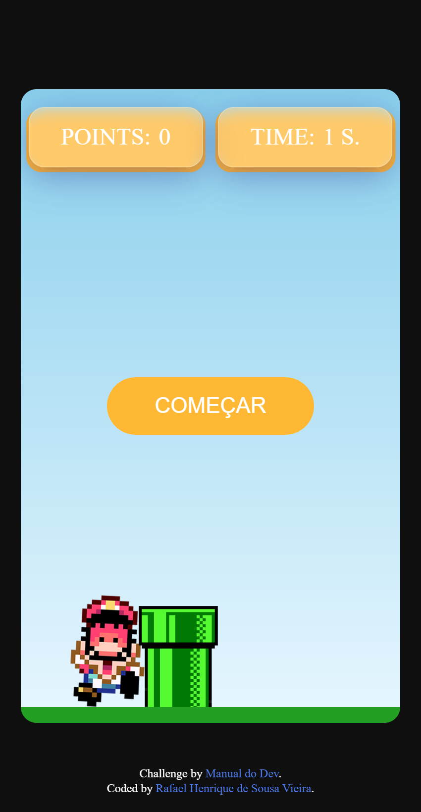

# Mario Game

> In this repository, a very simple Mario game is made, with a jump functionality. Using HTML, CSS and JAVASCRIPT

## Table of contents

- [Overview](#overview)
  - [The challenge](#the-challenge)
  - [Links](#links)
  - [Screenshot](#screenshot)
- [My process](#my-process)
  - [Built with](#built-with)

## Overview

### The challenge

Users should be able to:

- Play the mario game
- View the points counter
- Raise Points for each completed obstacle
- Able to jump with Mario
- View Game Animations

### Links

- Video URL: URL SOLUTION HERE
- Live Site URL: URL SITE HERE

### Screenshot

  - Desktop
  
    
    
  - Mobile
    
    

## My process

### Built with

- HTML
- CSS
- JAVASCRIPT

[⬆ Back to the top](#mario-game) 
